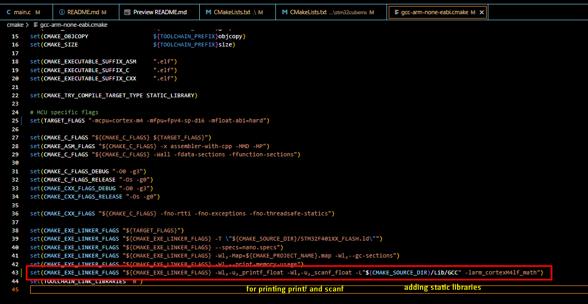

# DSP Operations on Nucleo-F401

This project demonstrates basic Digital Signal Processing (DSP) operations on the STM32 Nucleo-F401 development board. It uses STM32 HAL and CMSIS-DSP libraries to generate, process, and visualize signals.


# How to use SWV
SWV is not available on the VSCODE extension for now. So what you can do it generate the .elf file on Vscode and then debug using cubeIDE. I attach the details/snapshots on how to do this below


You can see the signal in the background


If you want to have a serial monitor which plots out signals you can use the Arduino IDE where when the signal data is transferred to the serial monitor it makes a nice graph and shows the values


1. ADD -u_printf_float -u_scanf_float in gcc_arm_none_eabi.cmake file to enable printing/accepting float values from scanf/printf 
2. Add the library path in gcc_arm_none_eabi.cmake file as I didn't find a way on how to add it from the CmakeLists.txt file

   

3.  Add macro ARM_MATH_CM4, __FPU_PRESENT in CMAKElists.txt file


These are the ARM official documentation links to refer to the different DSP functions they support
https://arm-software.github.io/CMSIS_5/DSP/html/index.html
https://arm-software.github.io/CMSIS_5/DSP/html/modules.html
   

All the DSP API's which you need to use must be added to the STM32_Drivers_Src macro in Cmakelists.txt to use them. By default they are not added and needs to be manually added in order to use them :(

If you are seeing problems with the SWV viewer, then try to add a delay like 10ms when plotting to see the correct signals on the graph.
usually when you are trying to see lot of variable values on the SWV then this might happen


## Features
- Signal generation (e.g., 5Hz sine wave)
- Signal plotting (via `plot_input_signal`)
- Example DSP operations (FIR, LMS, etc.)
- Modular code structure for easy extension

## Project Structure
```
Core/
  Inc/         # Header files
  Src/         # Source files
Drivers/       # STM32 HAL, CMSIS, and peripheral drivers
cmake/         # CMake toolchain and config files
CMakeLists.txt # Main CMake build script
```

## Getting Started
1. **Requirements:**
   - STM32 Nucleo-F401 board
   - ARM GCC toolchain
   - CMake 3.22+
   - STM32CubeMX (for code generation)
   - (Optional) STM32CubeIDE

2. **Build Instructions:**
   - Clone the repository
   - Run CMake to configure the project:
     ```sh
     cmake -B build -S .
     cmake --build build
     ```
   - Flash the generated `.elf` file to your Nucleo board using your preferred tool (e.g., ST-Link, CubeProgrammer)

3. **Usage:**
   - The firmware will generate and process signals as defined in `Core/Src/signals.c` and `main.c`.
   - Modify or extend signal processing functions as needed.

## File Highlights
- `Core/Src/signals.c` — Signal generation and plotting functions
- `Core/Src/main.c` — Main application logic
- `Core/Inc/signals.h` — Signal function declarations
- `CMakeLists.txt` — Project build configuration

## License
This project uses STM32 HAL and CMSIS-DSP libraries (see respective LICENSE files). Project code is provided for educational and demonstration purposes.

## Author
Akash811998
